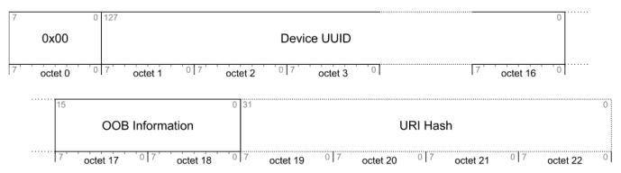
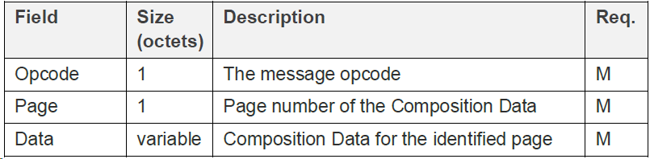
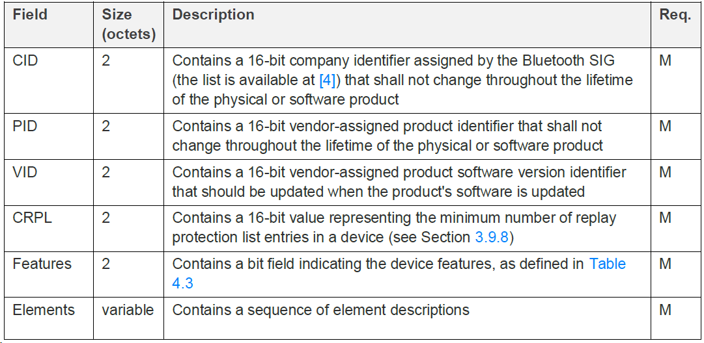
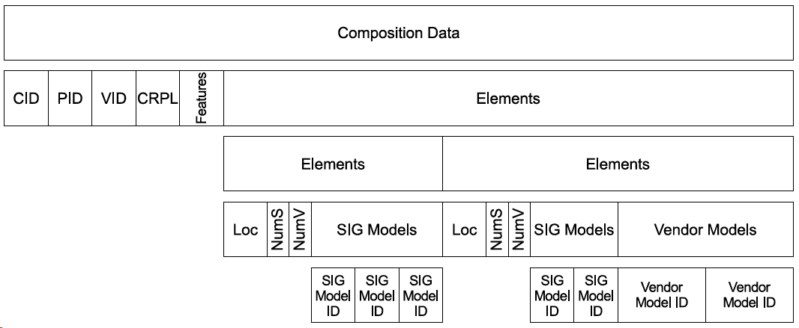
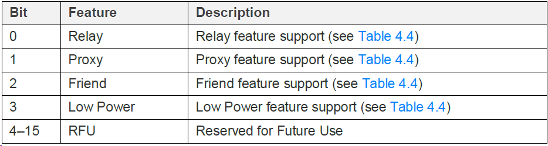
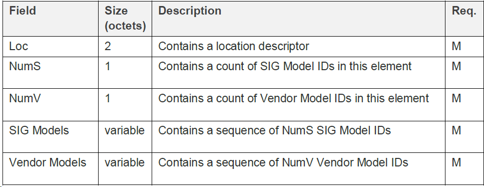
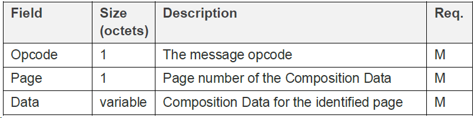

# Sigmesh Node Network Specification - V0.1

This article defines the network access specification for sigmesh devices. According to the network access specification in this article, devices can be distributed and communicate with the gateway through the gateway.  

## 1. Refrence  

[Bluetooth Mesh Official Specification Document](https://www.bluetooth.com/specifications/specs/?types=specs-docs&keyword=Mesh+Protocol&filter=)

## 2. Byte Order  

Based on the big and small endian byte order of the Access layer, that is, multi-byte numeric (short/int/float...) data uses `little endian byte order` .

## 3. UUID Configuration  

- The equipment to be distributed must support PB-ADV (broadcast link), PB-GATT ( BLE connection link).
- The app or gateway that completes the distribution network access can choose to support PB-ADV or PB-GATT, or both  

### 3.1 Unprovisioned device beacon  

- Apps and gateways discover devices through their broadcasts and obtain device information such as product IDs (PIDs). Unprovisioned Device Beacons packets must meet the following format.

    

- For mobile phones and other devices, because they do not support PB-ADV, they need to be networked through PB-GATT. Similarly, the BLE scan response packet of the device must meet the definition in the "Protco BLE Communication Protocol-V2.0 " specification.  

- It is recommended that the beacon transmission interval be less than or equal to 3 seconds; otherwise, network access may fail and the network access speed will be relatively slow.  

Among them, the PB-GATT broadcast packet format is as follows:  

Data segment description | AD Type | Data composition
---- | ---- | -----
 Device LE physical connection identification | 0x01 | Length: 0x02  Type: 0x01  Data: 0x06
 16-Bit service data | 0x16 | See the table below for service data formats

Field | Length(Bytes) | Description
---- | ---- | ----
 Length | 1 | N | N, the length is not fixed, the sum of the lengths of the following fields
 AD Type | 1 | 0X16, fixed to this value, represents 16-bit service data
 Service UUID | 2 | 0X1827 (Mesh Provisioning service), little endian transmission, actual transmission sequence: 0x27, 0x18
 Device UUID | 16 | Device UUID
 OOB Information | 2 | The OOB information of the device is mainly used for identity authentication when accessing the network

### 3.2 Device UUID  

The device UUID consists of the device Mac address, product capability value, and product model.  

UUID field introduction  

Type | Byte | Description
----| ---- | ----
 Mac | 6 | Bluetooth Mac address, needs to be filled in the specified byte order
 Device capability value | 2 | Device capability value, needs to be filled in the specified byte order
 Product model | 8 | Product model created by IoT platform, 8 bytes, less than 8 bytes are filled with 0 at the end

For example, if the MAC of the sub-device is 11:22:33:44:55:66, the device capability value is 0xAABB, and the hexadecimal of the UUID of the device with the product model abcdef is 66 55 44 33 22 11 BB AA 61 62 63 64 65 66 00 00 00  

### 3.3 Equipment capacity value  

 &nbsp; | Octet 1 | Octet 1 | Octet 1 | Octet 1 | Octet 0 | Octet 0
 --- | --- | --- | --- | --- | --- | ----
 Type | RFU | Broadcast capability | Device type | RFU | Product category | Product subcategory
 Bit  | bit15 |  bit14 | bit13-bit12 | bit11-bit8 | bit7-bit4 | bit3-bit0
 Function description  | Reserved Default is 0  | Broadcast capability is divided into 1 = long and short broadcast 0 = short broadcast | Device type is divided into 1 = standard type 0 = transparent transmission type | Reserved Default is 0 |  Product categories such as lighting, electrical, sensor, etc., see the table below for details | Product subcategories such as the number of lamps, the number of sockets, etc., see the corresponding category access documents for details

- Broadcast capability description  

Short broadcast: default broadcast, unicast transmission load capacity of up to 31 bytes, BLE4.0 and above support default broadcast packets.  

Long broadcast: extended broadcast, with a maximum transmission load of 255 bytes per packet. BLE5.0 supports extended broadcast packets.  

When the value is 1, it indicates support for long and short broadcasts, and when the value is 0, it indicates support for only short broadcasts. Long broadcasts are mainly used for OTA upgrades, which can greatly improve the upgrade speed.  

- Node type description  

Value | Device type | Explanation
---- | ---- | -----
 0 | Pass-through type | The pass-through data type refers to the pass-through module node, which is connected to the MCU through the serial port. The pass-through module is responsible for wireless data transmission and reception, and the device functions are implemented by the MCU.
 1 | Standard type | Standard node type, a node that integrates wireless data transmission and function
 2  | Reserved type | Not yet used
 3 | Reserved type | Not yet used

- Product type description  

Product Type | Product Category
------------ | -----------
 Lighting class | 0x01
 Electrical class | 0x02
 Sensor class | 0x03
 Remote Control class | 0x04
 Wireless Switch class | 0x05
 High Voltage Sensor | 0x06
 High Voltage Remote Control | 0x07

Note : The specific Mesh type will be described in the access protocols of different categories. For UUID formats that do not meet the definition, they cannot be registered to the IoT Cloud Computing Platform.  

For example, if the equipment supports long and short broadcasts, the product type is standard equipment, and it belongs to the lighting category, then its product capability value is 0x3010, as follows.  

&nbsp; | Octet 1 | Octet 1 | Octet 1 | Octet 1 | Octet 0 | Octet 0
---- | ---- | ---- | ---- | ---- | ---- | ----
 Type | RFU | Broadcast capability|  Device type | RFU | Product category | Product category
 Bit | bit15 | bit14 | bit13-bit12 | bit11-bit8 | bit7-bit4 | bit3-bit0
 Value | 0 | 1 | 1 | 0 | 1 | 0

### 3.4 Network equipment proxy service  

After the sub-node that supports proxy services has been deployed, it will broadcast its support for proxy services for mobile phones to directly connect to the Sigmesh sub-node, allowing mobile phones to access other sub-nodes in the entire Simgesh network through Bluetooth.  

Among them, the broadcast packet format is as follows:  

Data segment description | AD Type | Data composition
---- | ---- | ----
 Device LE physical connection identification | 0x01 | Length: 0x02  Type: 0x01  Data: 0x06
 16-Bit service data | 0x16 | See the table below for service data formats

The service data format is shown in the following table:  

Field | Length (bytes) | Explanation
---- | ---- | ----
 Length | 1 | N, the length is not fixed, the sum of the lengths of the following fields
 AD Type | 1 | 0X16, fixed to this value, represents 16-bit service data
 Service UUID | 2 | 0X1828 (Mesh Proxy Service), little endian transmission, actual transmission order: 0x28, 0x18
 Identification Type | 1 | Indication type
 Identification Parameters | N | Indication data

Among them, the indication type values are as follows:  

Type | Description
---- | ----
 0x00 | Network ID Type
 0x01 | Node indication type
 0x02 | Virtual Private Cloud Indication Type
 0x03 | Private node indication type
 0x04 - 0xFF | Reserved for future use

## 4. Standard General Information  

The general information of the device can be saved through the relevant fields in the Composition Data Page 0 of the Mesh standard protocol. The response format of the Composition Data Page 0 of the Mesh standard is as follows.  

The format of Data is as follows  

The format of Features is as follows  

The format of Elements is as follows  

### 4.1 Device firmware version  

Use the VID field in Composition Data Page 0.  

The version number format is a.b.c, and the field description is as follows  

- A: Indicates the major version number, modify it when it is backward incompatible
- B: Indicates the minor version number, which can be modified when adding new features for backward compatibility
- C: Indicates the revised version number, which will be modified during downward compatibility bug fixes  

The specific data bits are defined as follows  

&nbsp; | Octet 1 | Octet 1 | Octet 0
---- | ---- | ---- | ----
Type | Mainboard version number | Subversion number | Revision number
Bit position | bit15-bit12 | bit11-bit8 | bit7-bit0

For example, VERSION_ID = 0x1203 represents the 1.2.3 firmware version, as follows  

&nbsp; | Octet 1 | Octet 1 | Octet 0
---- | ---- | ---- | ----
Type | Mainboard version number | Subversion number | Revision number
Bit | bit15-bit12 | bit11-bit8 | bit7-bit0
Value | 1 | 2 | 3

The maximum firmware version represented by this representation method is: V15.15.255.  

### 4.2 Equipment product information  

The CID (COMPANY_ID) in Composition Data Page 0 is tentatively set to 0x0211.  
The PID (PRODUCT_ID) in Composition Data Page 0 must be unique, and the product functions must be consistent and different hardware must be guaranteed to be different.  

### 4.3 General information about features  

Use the Features field in Composition Data Page 0 for 16-bit data.  

&nbsp; | Octet 1 | Octet 0 | Octet 0 | Octet 0 | Octet 0 | Octet 0
----- | ------ | ----- | ----- | ----- | ---- | ----
Type | RFU | RFU | Low Power | Friend | Proxy | Relay
Bit | bit15-bit8 | bit7-bit4 | bit3 | bit2 | bit1 | bit0
Description | Reserved | Reserved | Standard definition, value 1 indicates support for low power consumption feature | Standard definition, value 1 indicates support for friendly feature | Standard definition, value 1 indicates support for proxy feature | Standard feature, value 1 indicates support for relay feature

The configuration of feature information needs to be based on the requirements of the corresponding product's network access specification.  

## 5. Private specific information  

Private definition of Composition Data Page 127 to transmit private information. `If the device does not need to support Page 127, it needs to fully follow the Mesh protocol to return a valid page that is smaller than 127 but closest to 127.`  

The Mesh protocol stipulates that the Access layer payload includes a maximum of 384 bytes for the TransMIC field, with a TransMIC length of 4 or 8 bytes, which is 4 bytes by default. The Access layer includes an opcode + opcode payload, with opcode lengths of 1, 2, and 3 bytes. Therefore, when the opcode length is 3 bytes and the TransMIC length is 8 bytes, the maximum payload length calculation formula is as follows:  

Maximum load length = 384 - 3 - 8 = 373  

**According to the above analysis, the maximum length of opcode payload is 373 bytes, excluding the number of bytes occupied by opcode.**

Therefore, the maximum length of Composition Data Page 127 that can be used to transmit private data is 373.  

Composition Data Page 127 response format is as follows.  

The format of the Data field is as follows.  

Field | Byte | Description
---- | ----- | --------
 Magic | 1 | Fixed at 0x5A, preparing for the recognition of page 127 in the subsequent Bluetooth mesh standard protocol
 TLDs | 0/N | Private data structure array, the specific number depends on the total length of the response data.   For example, TLD0, TLD1, TLD2...   Please refer to the table below for the format of private data structures

The data format of TLD is as follows.  

Field | Byte | Description
 ---- | ---- | ----
 Type | 1 | Data type
 Len | 1 | Data length
 Data | N | Types of data

The definition of the data type table is as follows.  

Type ID | Description
---- | ----
 0x00 | Single-byte communication protocol version number. If this field is not available, it defaults to 0. The high four digits are the main board number: modify it when there are major changes or incompatibility The low position is the minor version number: modified for minor changes or compatibility   For example:  0x00 -> 0b 0000 0000 -> V0.0  0x11 -> 0b 0001 0001 -> V1.1  0xAB -> 0b 1010 1011 -> V10.11
 0x01 | UUID in the device triple authorization code.  If there is such a data gateway, it will register to the cloud as a device ID. If not, it will register to the cloud as a device ID using the device MAC address.  If registered to the cloud with UUID, it is possible to add sub-devices to accounts across platforms in the same IOT platform environment.
 0x02 - 0x0F | Reserved for future use
 0x10 | Heartbeat reporting interval; the interval for low-power devices to actively report heartbeats, the data type is an unsigned 32-bit integer, the length is 4 bytes, and the unit is seconds.  The gateway will determine whether the low-power device is offline by receiving the heartbeat of the device within three times the value of this time interval.  It is recommended to report the battery level as heartbeat; this value is invalid for non-low power devices.
 Other values | Reserved for future use

For example, if the device triplet UUID is rn123456789ABCDE, the private entry data is as follows.  
`0x01 0x10 0x72 0x6E 0x31 0x32 0x33 0x34 0x35 0x36 0x37 0x38 0x39 0x41 0x42 0x43 0x44 0x45`  

## 6. mandatory provisions  

- The equipment must support PB-ADV and PB-GATT Bearer carriers.
- Non-low power devices must support Friend, Proxy, and Relay features.
- Low-power devices must support the Low Power feature.
- The device supports at least 1 NetKey and 2 AppKeys.
- All models are configured on the first element, except for the color temperature control model (0x8264) and the switch model of the multi-channel switching device (0x8201).
- The device must support shared binding processing app_key different element models, that is, support fast binding. If there are no special provisions (such as high security of the locking model, binding processing can be omitted), all models must share binding processing, that is, when receiving the Config AppKey Add (opcode = 0x00) message, the AppKey must be bound to all models.
- The device must support the addition and deletion processing of Generic OnOff Model subscription address shared by all models of different elements, that is, support fast subscription and achieve group control function; Example explanation: When the device Generic OnOff Model receives the subscription address addition command, other Models also need to automatically subscribe to the address (except for OTA-related models) ;
- Device OTA-related Models 0x1400 - 0x1405 (Blob Transfer Model/Firmware Update Model/Firmware Distribut Model) cannot share subscription address processing with other models, but OTA-related Models need to share subscription address processing.  

## 7. Offline detection mechanisms  

### 7.1 Non-low power devices  

The gateway actively sends a PING request to the node, and the node responds to the PING request. When the gateway sends three times in a row and the node does not respond, the device will be marked offline; any message received by the gateway device is considered as online. Please refer to the " sigmesh private protocol specification " for specific PING protocol implementation.  
The interval between gateway sending PING requests dynamically changes based on the total number of non-low-power devices in the current gateway. The minimum interval is 10 seconds and the maximum interval is 60 seconds. That is, the fastest detection device offline time is 30 seconds, and the slowest detection offline time is 180 seconds.  
For every 16 non-low-power devices added to the gateway, the PING request interval increases by 10 seconds. Example explanation: When the number of non-low-power devices added by the gateway is less than or equal to 16, the PING interval is 10 seconds. When the number of non-low-power devices added by the gateway is between 17 and 32, the PING request interval is 20 seconds, and so on.  

### 7.2 Low-power devices  

The gateway detects the device offline based on three times the heartbeat reporting interval time obtained when the low-power device is connected to the network. That is, if the gateway does not receive any messages from the device within three times the time, the device will be marked offline. Example: When the heartbeat interval reported by the low-power device is 30 seconds, the gateway will detect whether any messages from the low-power device are received within 90 seconds. If not, the device will be marked offline.  

## 8. Time synchronization mechanism  

There are two ways to synchronize the time and time zone of the node gateway  

1. Actively obtain the time of the gateway through the Time Get command specified by the official mesh protocol (Chapter 5.2.1.1 of the MshMDL_v1 documentation)
2. Actively obtain the time of the gateway through private GET_GW_TIME commands [(sigmesh private protocol specification)](sigmesh_private_protocol.md)  

Synchronization mechanism is as follows  

1. After the node is powered on, it actively obtains the time of the gateway through the public Time Get command or the private GET_GW_TIME command in a timely manner. When the invalid time is obtained, it can be repeated at random intervals for a certain period of time until the time is valid.
2. After the time synchronization is successful, the device can continue to synchronize the gateway time with a relatively long interval and add a random delay to correct the clock deviation problem of the device.  

## 9. ~~Public DP definition (deprecated)~~

~~When the gateway processes the public DP identifier, it preferentially converts it to the sigmesh standard protocol command for forwarding, and only smuggles the protocol channel for transmission when it cannot be converted to the corresponding standard protocol. Therefore, when creating the function of the product, it is necessary to consider whether to convert it to the sigmesh public protocol for transmission. If the DP definition does not conform to the definition in the public DP table, the DP identifier cannot be defined as the public DP identifier name as follows.~~

~~The public DP table is as follows~~
