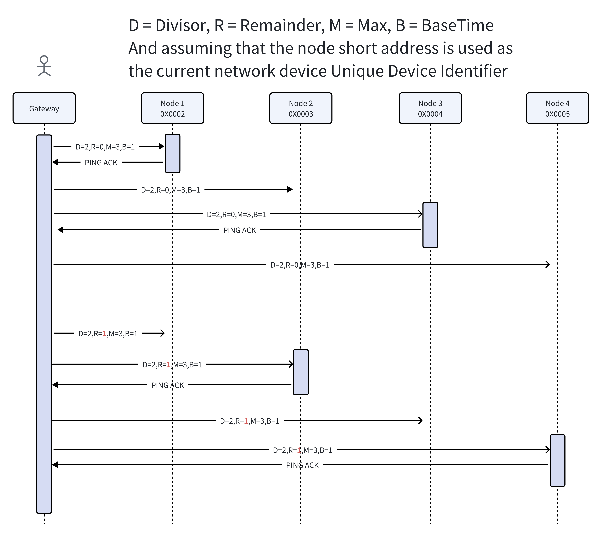

# Sigmesh Private Communication Protocol - V0.1

This article defines the protocol format in the Protco Vendor Model to achieve private data transmission, which can achieve control logic or data transmission that cannot be achieved in the standard model of the Bluetooth Mesh Model.  

Considering the characteristics of Bluetooth MESH for transmitting small amounts of data, the protocol is based on the principle of simplification, that is, rules such as saving where possible and bit marking.  

## 1. Overview  

The main categories of Bluetooth mesh products include lighting, electrical, sensing, remote control, etc. When designing the Bluetooth mesh product system, the standard model of Bluetooth should be given priority to achieve its functions. For example, for the switch of the lighting category, the Generic On/Off Model is used.  

Due to the limited functionality of the standard Model, it is necessary for the manufacturer Model to define private features. For example, Bluetooth lighting products use the manufacturer Model to achieve scene configuration and switching.  

## 2. Vendor Model  

The vendor model must be configured on the first element of the device and support fast binding of App Key (shared binding) and fast subscription of subscription address (shared subscription). The details of sharing processing can be referred to " sigmesh node network access specification " "Other provisions" section  

### 2.1 Model ID  

The Client model ID and server level model ID of the private model are described as follows:  

Vendor ID: 0x0211

- Server Model ID：0x0211 0000
- Client Model ID：0x0211 0001

### 2.2 Model Cmd  

The command words supported by the private model are described as follows:  

Cmd | Opcode | Client：0x02110001 | Server：0x02110000
---- | ---- | ---- | ----
GET | 0xE80211 | Query data request | -
SET | 0xE90211 | Set up data requests with retransmission mechanism | -
SET_UNACK | 0xEA0211 | Setup data requests that do not require a response | -
STATUS | 0xEB0211 | - | Data response or proactive reporting
STC_REQ | 0xEC0211 | - | Server level data requests to clients
CTS_RSP | 0xED0211 | Client's data response to the server | -

### 2.3 Command usage rules  

1. The private model must be configured on the first element of the node.  
2. The sender uses GET, SET, SET_UNACK model command words, and the receiver uses the STATUS model command word when sending a response  
3. The sender uses GET to send the private protocol, and the receiver needs to use STATUS when sending the private protocol response.  
4. The sender uses SET to send private protocols, and the receiver needs to use STATUS when sending private protocol responses.  
5. When the sender multicasts or broadcasts a private protocol, if SET_UNACK is used, the receiver cannot reply with STATUS after receiving it.  
6. When the sender multicasts or broadcasts a private protocol, if SET is used, the receiver needs to reply with STATUS after receiving it.  
7. If the server level needs to get data from the client, the server level uses the STC_REQ command to initiate the request, and the client uses the CTS_RSP to reply;  

### 2.4 Package data length  

The Mesh protocol stipulates that the Access layer payload includes a maximum of 384 bytes in the TransMIC field, with a TransMIC length of 4 or 8 bytes, which is 4 bytes by default. The Access layer includes Opcode + payload, with Opcode lengths of 1, 2, or 3 bytes.  

When the length of Opcode is 3 bytes and the length of TransMIC is 8 bytes, the calculation formula for the maximum length of the load is as follows:  

Total data length before maximum subcontracting = 384 - 3 - 8 = 373  

Based on the above analysis, it is known that the maximum length of private Opcode transmission data is 373 bytes, excluding the number of bytes occupied by Opcode .  

## 3. Definition  

### 3.1 Byte order  

Multibyte numeric (short/int/float...) data is transmitted in big endian byte order.  

### 3.3 DataPoint Functional Button  

IoT platforms mainly use DP to describe functions. When implementing functions using standard models, apps or gateways mainly do the following work:  

1. Query the standard DP and standard model mapping table, convert the DP into a standard model command, and send it to the Bluetooth mesh network.  
2. Convert the standard model command to DP and report to the cloud.  

When using the vendor model to implement DP data transmission function, the App or gateway will pass-through DP according to the following data structure:  

Field | Byte | Explanation
---- | ---- | -----
Dpid | 1 | DP function endpoint number, defined by the platform product
Type | 1 | Corresponding to the data type of Functional Button on the IoT platform, the specific definition is below
Len | 1 | Byte data length of the Data field. `Note: The numeric types listed below do not have this field, only other types have this field.` <br/>PROP_BOOL PROP_INT PROP_FLOAT PROP_ENUM <br/>Such as type of PROP_BOOL, Data length is 1 by default. PROP_INT, Data length is 4 by default Data 1/4/N Hex indicates that numeric types larger than 1 Byte are transmitted using big endian

The definition of Type is as follows  

Type | Value | Length | Explanation
---- | ---- | ---- | ----
 Unknown | 0 | N | Unknown type
 BOOL | 1 | 1 | Boolean type, value range 0-1
 INT | 2 | 4 | Integer, need to be transmitted in the specified byte order, value range -2147483648~ 2147483647
 FLOAT | 3 | 4 | Floating-point type, needs to be transmitted in the specified byte order, with a value range of -2 ^ 128~ + 2 ^ 128, that is, -3.40E + 38~ + 3.40E + 38
 ENUM | 4 | 1 | Enumeration type, value range 0x00 - 0xFF
 FAULT | 5 | N | Error string type, length not exceeding 0xFF
 TEXT | 6 | N | Text string type, length not exceeding 0xFF
 RAW | 7 | N | Pass-through type, Hex (hexadecimal) ByteFlow data Example: For example, to transmit the string "123" "123" -> 0x31 0x32 0x33
 STRUCT | 8 | N | Structure type
 ARRAY | 9 | N |Array type

```C
typedef enum {
    PROP_UNKNOWN, //unknown type
    PROP_UNKNOWN, //unknown type
    PROP_BOOL, //1 byte numeric boolean
    PROP_BOOL, //1 byte numeric boolean
    PROP_INT, //4 byte numeric integer
    PROP_INT, //4 byte numeric integer
    PROP_FLOAT, //4 byte numeric floating point
    PROP_FLOAT, //4-byte numeric float
    PROP_ENUM, //1 byte numeric enumeration
    PROP_ENUM, //1 byte numeric enumeration
    PROP_FAULT, //error string
    PROP_FAULT, //Error string
    PROP_TEXT, //text string
    PROP_TEXT, //text string
    PROP_RAW, //raw hexadecimal byte array data
    PROP_RAW, //raw hexadecimal byte array data
    PROP_STRUCT, //Structure type
    PROP_STRUCT, //structure type
    PROP_ARRAY, //array type
    PROP_ARRAY, //array type
} DP_PROP_TP_E;
```

### 3.4 Definition of Receiving and Receiving Objects  

Object | Explanation
---- | ----
 Gateway | Gateway
 CtrlNode | Control nodes mainly include switches, remote controls, sensors and other node devices
 TargetNode | Target nodes mainly include execution devices such as light bulbs and sockets

- The target node and the control node can coexist.
- When a Node sends a message to another Node, the Node that sends the message is called the controlling Node.
- When a node receives a message from a gateway or control node, it is called a target node.

## 4. Interaction description  

### 4.1 Local remote control interaction logic  

When the local remote control is bound to the target device, the binding entry is only saved in the target device, and the remote control itself does not save any data. `All the key functions of the remote control send fixed commands in the form of broadcast address (0xFFFE)` The target device receives the command and recognizes whether it is the short address of the bound remote control. If not, the command is discarded. If so, continue to judge whether the specified key group is bound or does not need to judge the specified key group. If not, the command is discarded, and if so, the command is executed.  

The command prefix " `LOCAL_REMOTE_CTRL` " in the command word table between the above nodes belongs to the command word described in this chapter.  

The explanation of binding table entry fields is as follows  

Field | Byte | Description
---- | ---- | ----
 Group_ID | 2 | Group ID for grouping
 Short_Addr | 2 | Short address of the bound remote control
 Key_DPID | 1 | The grouping button DPID of the remote control is obtained from the product function interface of the IOT platform
 DPID_Num | 1 | Number of DPID bindings, If it is 0, it represents all, and the length of the DPIDs field is 0. If it is not 0, it means that only some DPs specified by this node are bound.
 DPIDs | 0/N | Array of DPIDs, with a single DPID length of 1 byte. The length of this field is determined by the number of DPIDs. For example, dpid0, dpid1, dpid2...

Key scene table entry field description is as follows  

Field | Byte | Description
---- | ---- | -----
 Short_Addr | 2 | Short address of the bound remote control
 Flag | 1 | 8-Bit unsigned data, value by bit. - Bit0: Key_DPID valid flag to specify whether key grouping or all groupings 1: valid, 0: invalid When it is 0, the target node does not need to determine whether the specified Key_DPID has been bound, only to identify whether the short address of the remote controller in the binding table. Other bits are reserved and filled with 0.
 Key_DPID | 1 | DPID values of grouped buttons are obtained from the product function interface of the IOT platform. When bit0 of Flag is 0, any value can be filled at will
 Key_Scene_ID | 1 | Key value of scene key, value range 0x00 - 0xFF
 DP_Num | 1 | Record the number of DP in the current state
 DPs | N | DP structure array, DP structure format view DataPoint. The length of this field depends on the number of DP. For example: DP0, DP1, DP2...

When deleting the binding table, it is also necessary to synchronously delete the corresponding key scene table.  

### 4.2 Set the interaction logic for adding or deleting groups on a node  

Fully use standard public protocols to set nodes to add or delete groups, that is, subscribe to group addresses or delete subscribed group addresses.  

## 5. Frame format  

In order to minimize data, it is compressed into a short broadcast single packet output, so the protocol is concise enough. The command length can be calculated and obtained based on the type of command received and the length of the received data.  

The frame format is: Model Cmd Opcode (3 Bytes) + Cmd (1 Byte) + Data (N Bytes).  

Field | Byte | Explanation
---- | ---- | ----
 Opcode  | 3 | Opcode for private Model Cmd, see the "Model Cmd" section for specific type definitions
 Cmd | 1 | Command types, for specific type definitions, please refer to the "Command Type Table" section
 Data | N | Command load data, for specific load format, please refer to the "Command Load Format" section

`The maximum effective length of a single packet is 11 Bytes, so the maximum length of a single packet of Data is 7 Bytes`  

## 6. Command type table  

### 6.1 Command word table between gateway and node  

The command word range is \[0x00 - 0x3F].  

Model Cmd | Command | Value | Explanation
---- | ---- | ---- | ----
 SET_NOACK | PING | 0x00 | Heartbeat PING request, gateway PING node The SET_NOACK model command word is used because PING_ACK is not an immediate response and does not require the use of a reliably transmitted SET model command
 STATUS | PING_ACK | 0x01 | Response to heartbeat PING request, node response gateway
 GET | GET_DP | 0x02 | Query node DP
 SET | SET_DP | 0x03 | Set node DP
 STATUS | DP_ACK | 0x04 | Query/set the response of node DP
 STATUS | DP_REPORT | 0x05 | Node actively reports DP status
 SET | BIND_DP | 0x06 | Bind node DP, set the relationship between the control node DP and the controlled node DP
 STATUS | BIND_DP_ACK | 0x07 | Response of binding node DP
 SET | SET_SCENE | 0x08 | Set node scene
 STATUS | SET_SCENE_ACK | 0x09 | Set response for node scene
 SET | RECALL_SCENE | 0x0A | Recovery scenario
 STATUS | RECALL_SCENE_ACK | 0x0B | Respond to scene
 SET | SET_DP_GROUP | 0x0C | Set DP group
 STATUS | SET_DP_GROUP_ACK | 0x0D | Set response for DP group
 STC_REQ | GET_GW_TIME | 0x0E | Get the gateway time, the node actively gets the gateway time.
 CTS_RSP | GET_GW_TIME_ACK | 0x0F | Obtain the response of the gateway time, and the gateway passively responds to the node time
 SET | CLEAR_DATA | 0x10 | Clear node data
 STATUS | CLEAR_DATA_ACK | 0x11 | Response to clear node data
 SET | BIND_REMOTE_CTRL | 0x12 | Set up node binding remote control for bulb node, supporting at least 8 binding table entries
 STATUS | BIND_REMOTE_CTRL_ACK | 0x13 | Set the response of the node binding remote control
 SET | UNBIND_REMOTE_CTRL | 0x14 | Set node unbind remote control for bulb node
 STATUS | UNBIND_REMOTE_CTRL_ACK | 0x15 | Set the node to unbind the response of the remote control

### 6.2 Command word table between nodes  

The command word range is \[0x40 - 0x7F].  

Model Cmd | Command | Value | Explanation
---- | ---- | ---- | ----
 SET | LOCAL_SYNC_DOUBLE_CTRL_STATE | 0x40 | Local synchronous dual-control status command for dual-control switching lamp equipment
 STATUS | LOCAL_SYNC_DOUBLE_CTRL_STATE_ACK | 0x41 | Local synchronous dual control status command response (reserved, no response between nodes for the time being)
 SET | LOCAL_RECALL_SCENE | 0x42 | Local restore scene for scene switch light device
 STATUS | LOCAL_RECALL_SCENE_ACK | 0x43 | Local recovery scene response (reserved, no response between nodes for the time being)
 SET | LOCAL_SET_DP | 0x44 | Local setting node DP for scene switching lamp equipment
 STATUS | LOCAL_SET_DP_ACK | 0x45 | Local setting node DP response (reserved, no response between nodes)
 SET_UNACK | LOCAL_REMOTE_CTRL_BIND | 0x46 | The local remote control is bound to a device in a bound state, and the bound device supports at least 8 bound table entries. <br/>For example: the light bulb will be in the binding and unbinding state within 16 seconds of restarting, and it will flash once after successful binding
 SET_UNACK | LOCAL_REMOTE_CTRL_UNBIND | 0x47 | Local remote control unbind device
 SET_UNACK | LOCAL_REMOTE_CTRL_XXX | 0x48-0x4F | Local remote control management commands are reserved for future use
 SET_UNACK | LOCAL_REMOTE_CTRL_ONOFF | 0x50 | Local remote control sets the switch of the target node
 SET_UNACK | LOCAL_REMOTE_CTRL_SET_LEVEL | 0x51 | Set the brightness of the target node with the local remote control
 SET_UNACK | LOCAL_REMOTE_CTRL_SET_COLOR_TEMP | 0x52 | Set the color temperature of the target node with the local remote control
 SET_UNACK | LOCAL_REMOTE_CTRL_SET_COLOR | 0x53 | Set the color of the target node with the local remote control
 SET_UNACK | LOCAL_REMOTE_CTRL_MOVE_LEVEL | 0x54 | Adjust the brightness of the target node with the local remote control
 SET_UNACK |LOCAL_REMOTE_CTRL_MOVE_COLOR_TEMP | 0x55 | Local remote control adjusts the color temperature of the target node
 SET_UNACK | LOCAL_REMOTE_CTRL_MOVE_HUE | 0x56 | Local remote control adjusts the chromaticity of the target node
 SET_UNACK | LOCAL_REMOTE_CTRL_SET_LEVEL_COLOR_TEMP | 0x57 | The local remote control sets the brightness and color temperature of the target node
 SET_UNACK | LOCAL_REMOTE_CTRL_SCENE_SWITCH | 0x58 | Local remote control switches target node default scene
 SET_UNACK | LOCAL_REMOTE_CTRL_SCENE_SAVE | 0x59 | The local remote control sets the target node to save the scene, and the target device supports at least 8 custom scene table entries.
 SET_UNACK | LOCAL_REMOTE_CTRL_SCENE_RECALL | 0x5A | Set target node recovery scene for local remote control
 SET_UNACK | LOCAL_REMOTE_CTRL_SCENE_DELETE | 0x5B | Set target node delete scene with local remote control

## 7. Command payload format between gateway and node  

Please refer to the "Command Type Table" section for specific command type definitions  

### 7.1 PING  

Direction: Gateway - > TargetNode  

Gateway PING node request refers to the request of the gateway to actively query whether the long power (non-low power) node is online. By controlling whether the node responds and the response delay time through request parameters, it avoids the situation that the receiving node sends a response to the gateway at the same time, causing network congestion. This command is mainly used for gateway broadcast transmission (or unicast). By controlling the change of divisor and remainder, all sub-nodes can respond in batches and with random delay. Please refer to the offline detection mechanism chapter of " sigmesh node network access specification " for the offline detection mechanism of non-low power devices and low power devices.  

Field | Byte | Explanation
---- | ---- | ----
 Divisor | 1 | Unsigned integer; divisor, non-zero value;
 Remainder | 1 | Unsigned integer; remainder;
 Max | 1 | Unsigned integer; maximum delay, sub-node needs to take a random number Random between \[0 - Max], including 0 and Max <br/>(Max value needs to consider that the calculated random delay time must be less than the PING request interval and cannot be equal to it. Otherwise, in extreme cases, it may cause the gateway to receive a response from the sub-device after executing the offline detection mechanism.)
 BaseTimeMs | 1 | Unsigned integer; delay reference time, unit: ms; delay response calculation formula is: Random * BaseTimeMs
 ReportWaitTime | 1 | Unsigned integer; fixed delay time for reporting device status after multicast/broadcast control status, unit: seconds <br/>(Fixed delay time is to solve the problem of network congestion caused by frequent reporting of status due to receiving multiple commands in a short period of time.)<br/>Value selection description: <br/> 0X00 - Fixed delay time is 0, no delay is required. <br/>0xFF - Permanent delay, which means that the device status is not reported after multicast/broadcast control. <br/>Other values - delay time;
 ReportRandomTime | 1 | Unsigned integer; Random delay time for reporting device status after multicast/broadcast control status, unit: seconds <br/>(Need to convert seconds to milliseconds and treat it as the maximum random number to obtain the random delay time) <br/>Value selection description: <br/>0X00 - Random delay time is 0, no delay is required.<br/>Other values - delay time;

Node status delay report parameter description:  

After the node receives the multicast/broadcast control status command, it needs to delay the fixed waiting time ReportWaitTime first, and then expand the ReportRandomTime seconds by 1000 times and convert it into a millisecond value. The random value between \[0- (ReportRandomTime * 1000) ] is taken as the random delay millisecond number. When the random delay expires, it reports the latest status of the device. The role of the fixed delay time is to avoid the occurrence of network congestion caused by frequent reporting by multiple nodes due to a large number of multicast/broadcast controls in a short time.  

For example:  

ReportWaitTime = 10，ReportRandomTime = 20  

After the node receives multicast/broadcast control, it needs to fix the delay for 10 seconds first, and then take a random value within 0 to 20 * 1000 milliseconds to start random delay, and report the status after random delay  

The processing mechanism for whether a node responds to a command is as follows  

- Response condition: Unique Device Identifier% Divisor == Remainder  

- Delayed response time: BaseTimeMs * random (0, Max)  

Among them  

- Random (0, Max) indicates taking a random number between 0 and Max, including 0 and Max.  

- When using random () % Max to limit the maximum value of random numbers, it is necessary to consider the case where Max is 0. Taking the remainder when Max is 0 is illegal.  

- Random () uses the device short address as the random number seed to generate random numbers. Be sure to use the device Unique Device Identifier to initialize the random number seed.  

- The Unique Device Identifier can be the MAC address or short address of a node, as long as it is unique within the same network.  

Interaction example  



### 7.2 PING_ACK

`Direction: TargetNode - > Gateway`  

When a node responds to a PING request from the gateway, it needs to strictly follow the parameters of the request for random delay. The load format is as follows.  

Field | Byte | Description
---- | ---- | ----
 ver | 2 | Firmware version number, 16-bit integer data, details see " sigmesh node network access specification " device firmware version introduction
 MCU_Ver | 0/2 | Pass-through module external MCU firmware version, if it is not a pass-through module, there is no field; format conversion is consistent with the firmware version number definition.  

### 7.3 GET_DP

`Direction: Gateway - > TargetNode`  

Gateway query node DP request, payload format is as follows  

Field | Byte | Description
---- | ---- | ----
 DPID_Num | 1 | DPID quantity, if the quantity is 0, report all DP statuses. <br/> If the quantity is 0, there will be no subsequent fields.
 DPIDs | 0/N | Array of DPIDs, with a single DPID length of 1 byte. <br/>The length of this field is determined by the number of DPIDs. <br/>For example, dpid0, dpid1, dpid2...

### 7.4 SET_DP  

`Direction: Gateway - > TargetNode`  

Gateway setting node DP request, load format as follows  

Field | Byte | Description
---- | ---- | ----
 DP_Num | 1 | DP number, if it is 0, there is no subsequent field
 DPs | 0/N | DP structure array, DP structure format view DataPoint <br/>The length of this field depends on the number of DP. <br/>For example: DP0, DP1, DP2...

### 7.5 DP_ACK

`Direction: TargetNode - > Gateway`  

The node receives the response of the query/setting DP request from the gateway, and the payload format is as follows.  

Field | Byte | Description
---- | ---- | ----
 DP_Num | 1 | DP number, if it is 0, there is no subsequent field
 DPs | 0/N | DP structure array, DP structure format view DataPoint. <br/> The length of this field depends on the number of DP. <br/> For example: DP0, DP1, DP2...

### 7.6 DP_REPORT  

`Direction: TargetNode - > Gateway`  

Node detects a state change and actively reports the DP command, with the following payload format:.  

Field | Byte | Description
---- | ---- | ----
 DP_Num | 1 | DP number, if it is 0, there is no subsequent field
 DPs | 0/N | DP structure array, DP structure format view DataPoint <br> The length of this field depends on the number of DP. <br/>For example: DP0, DP1, DP2...

### 7.7 BIND_DP  

`Direction: Gateway - > TargetNode`  

Gateway binding control DP requests, that is, binding the target DP to the control DP to establish a binding relationship and set the specific functions of the control DP; the binding data is issued in full, and the existing data is directly overwritten when modified.  

The explanation is as follows  

- Control DP: DP for controlling objects such as remote controllers. For example, remote control buttons have multiple operation types, such as short press, long press, and tap press. This type of button operation controls the specific value of DP.  

- Target DP: DP for target objects such as switches, brightness, color temperature, color, etc.  

An example is as follows  

- After binding the light bulb to the short press of button 1 on the remote control, press button 1 and the remote control will directly send the DP command to turn on the light bulb.  

Load format is as follows  

Field | Byte | Description
---- | ---- | ----
 Bind_Dp_Num | 1 | The number of binding DP, if it is 0, there is no subsequent field; indicating that all binding data of the node is cleared  
 Bind_Dps | 0/N | Bind DP structure array, depending on the number of bound DP. <br/>For example Bind_Dp0, Bind_Dp1, Bind_Dp2... DP <br/>Please refer to the table below for the binding DP structure format.

Bind_Dps data formats are as follows.  

Field | Byte | Description
---- | ---- | ----
 Dp_Value_Num | 1 | Number of binding DP values
 Dp_Value_Binds | N | DP value binding structure array, depending on the number of bound DP values. <br/>For example: Dp_Value_Bind0, Dp_Value_Bind1... <br>Please refer to the table below for the DP value binding structure format

Dp_Value_Binds data formats are as follows.  

Field | Byte | Description
---- | ---- | ----
 Ctrl_Dp | N | Control DP, DP structure format View DataPoint
 Ctrl_DpActions_Num | 1 | Control the number of behaviors of DP. If it is 0, there will be no subsequent fields, indicating that the binding behavior data of the corresponding value of DP is cleared
 Ctrl_DpActions | 0/N | Control the behavior data structure array of DP, depending on the number of behaviors. <br/>Like Ctrl_DpAction0, Ctrl_DpAction1, Ctrl_DpAction2... <br/>Please refer to the table below for the format of the behavioral data structure.

Ctrl_DpActions data formats are as follows.  

Field | Byte | Description
---- | ---- | ----
 Delay_Time | 2 | Delay the time to send the target message, unit: seconds
 Target_Type | 1 | Target object type, with the following values: <br/> 1: Local device<br/>2: Local groups <br/>3: Local scene/One-click execution
 Target_Object | 2/4 | Target object, please refer to the table below for specific format.
 Target_DPs_Len | 1 | The total length of the target DP data, if it is 0, there will be no subsequent fields.
 Target_DPs | 0/N | Target DP data, please refer to the table below for specific format.

Target_Object data formats are as follows.  

Field | Byte | Description
---- | ---- | ----
 Target_ID | 2 | If the type is local device, this field is the short address of the device. <br/>If the type is a local group, this field is the group address. <br/>If the type is a local scene, this field is the group address associated with the scene.
 Scene_ID | 0/2 | If the type is local device/local group, there is no such field. <br/>If the type is a local scene, this field is the scene ID.

Target_DPs data formats are as follows  

Field | Byte | Description
---- | ---- | ----
 DPs_Num | 1 | DP number, if it is 0, there is no subsequent field
 DPs | 0/N | DP structure array, DP structure format view DataPoint <br/>The length of this field depends on the number of DP.  <br/>For example: DP0, DP1, DP2...

### 7.8 BIND_DP_ACK  

`Direction: TargetNode - > Gateway`  

The node receives the response of the binding DP request of the gateway, and the load format is the same as the BIND_DP request load format.  

If the device can only handle part of the target object, it can respond to the relevant data of the target object that can be operated.  

### 7.9 SET_SCENE  

`Direction: Gateway - > TargetNode`  

The gateway sets up node scene data requests. Considering that there may be a lot of scene data, a packet field is added to the load header.  

Load format is as follows.  

Field | Byte | Description
---- | ---- | ----
 Sequence | 1 | Serial number , used for unpacking and grouping <br/>When unpacking, the serial number of the same package is consistent <br/>When grouping packages, the serial number of the same package is consistent
 Packet | 1 | Used for unpacking and grouping processing. <br/>High four digits: total package number, starting from 1 <br/>Lower four digits: package number, starting from 0 <br/>When the total number of packages is 1, a package number of 0 is considered complete
 Group_ID | 2 | The group address associated with the scene, the node needs to add the group address to the node group address table after receiving it
 Scene_ID | 2 | Scene_ID
 Operat_Type | 1 | Operation type, values are as follows: <br/>1: Add/modify <br/>2: Delete; if it is this value, there will be no subsequent fields. <br/> 6: Deactivated; if it is this value, there will be no subsequent fields. <br/>7: Enable; if this value is used, there will be no subsequent fields.
 Scene_Num | 0/1 | The number of scene data, if it is 0, there is no subsequent field.
 Scene_Data | 0/N | Scene data structure array, depending on the number of scenes. <br/>For example Scene_Data0, Scene_Data1, Scene_Data2... <br/>Please refer to the table below for the format of the scene data structure

Scene_Data data formats are as follows  

Field | Byte | Description
---- | ---- | ----
 Order_ID | 1 | Execution sequence number
 Delay_Time | 2 | Delay the execution time of the scene, unit: seconds
 Dp_Data_Len | 1 | DP data length, if it is 0, there are no subsequent fields.
 DP_Num | 0/1 | DP number, if it is 0, there is no subsequent field
 DPs | 0/N | DP structure array, DP structure format view DataPoint <br/>The length of this field depends on the number of DP. <br/>For example: DP0, DP1, DP2...

### 7.10 SET_SCENE_ACK  

`Direction: TargetNode - > Gateway`  

The node receives a response to the setting scenario request from the gateway.  

Load format is as follows.  

Field | Byte | Description
---- | ---- | ----
 Result | 1 | The result of the setting is as follows: <br/>0X00: Success <br/>0X01: Scene not found <br/>0X02: Insufficient storage space <br/>Others: Reserved
 Group_ID | 2 | The group ID associated with the scene, the node needs to add the group ID to the node group address table after receiving it
 Scene_ID | 2 | Scene ID
 Operat_Type | 1 | Operation type, values are as follows: <br/>1: Add/modify <br/>2: Delete; if it is this value, there is no subsequent field. <br/>6: Deactivated; if it is this value, there will be no subsequent fields. <br/>7: Enable; if it is this value, there will be no subsequent fields.

### 7.11 RECALL_SCENE

`Direction: Gateway - > TargetNode`  

Gateway setup node recovery scenario request.  

Load format is as follows.  

Field | Byte | Description
---- | ---- | ----
 Group_ID | 2 | Group ID associated with the scene
 Scene_ID | 2 | Scene ID

### 7.12 RECALL_SCENE_ACK

`Direction: TargetNode - > Gateway`

The node receives a response to the recovery scene request.  

Load format is as follows.  

Field | Byte | Description
---- | ---- | ----
 Result | 1 | The result of the setting is as follows <br/>0X00: Success <br/>0X01: Scene not found <br/>Others: Reserved
 Group_ID | 2 | Group ID associated with the scene
 Scene_ID | 2 | Scene ID

### 7.13 SET_DP_GROUP

`Direction: Gateway - > TargetNode`  

Gateway sets DP groups; used to set nodes to specify DP add/delete groups.  

Used to set the logic dual-control switch function. When adding a group, it is equivalent to adding multiple switches to one dual-control group. When deleting a group, it is equivalent to removing multiple switches from the dual-control group.  

Load format is as follows.  

Field | Byte | Description
---- | ---- | ----
 Group_ID | 2 | After receiving the group ID, the node needs to add the group ID to the node group address table or delete it from the group address table
 Operat_Type | 1 | Operation type, values are as follows: <br/>1: Add/modify <br/>2: Delete; if it is this value, there will be no subsequent fields.
 DPID_Num | 0/1 | The number of DPIDs, if it is 0, there are no subsequent fields
 DPIDs | 0/N | Array of DPIDs, with a single DPID length of 1 byte. <br/>The length of this field is determined by the number of DPIDs. <br/>For example, dpid0, dpid1, dpid2...

### 7.14 SET_DP_GROUP_ACK  

`Direction: TargetNode - > Gateway`  

Node receives a response to set the DP group.  

Load format is as follows  

Field | Byte | Description
---- | ---- | ----
 Result | 1 | The result of the setting is as follows: <br/>0X00: Success <br/>0X01: Subscription table (group address table full) <br/>0X02 : Insufficient storage space <br/>0X03: Unknown DP <br/>Others: Reserved
 Group_ID | 2 | Group ID
 Operat_Type | 1 | Operation type

### 7.15 GET_GW_TIME

`Direction: TargetNode - > Gateway`  

Command for node to obtain gateway time, no load.  

- When no response is received from the gateway, the request can be repeated a certain number of times with a certain delay.  

- When the obtained UTC time is less than the firmware release time, the query can be repeated for a certain period of time until a valid UTC time is obtained, because the gateway needs to spend some time synchronizing network time.  

### 7.16 GET_GW_TIME_ACK

`Direction: Gateway - > TargetNode`  

The gateway receiving node obtains the response of the time request.  

- The processing of daylight saving time can be determined based on the start and end UTC time and UTC time. If entering daylight saving time, it will be accelerated by 1 hour, and if exiting daylight saving time, it will be slowed down by 1 hour.  

- During the sunrise and sunset time of the day, synchronization processing needs to be performed according to the local time every day. If the difference between the sunrise and sunset UTC time and UTC time is 24 hours or more, it indicates that the sunrise and sunset UTC time is invalid.  

Load format is as follows  

Field | Byte | Description
---- | ---- | ----
 UTC | 4 | Unsigned integer; UTC timestamp, 0 represents invalid value, unit: seconds. <br/> 'Note: The timing starts from 2000-01-01 00:00:00 according to the official agreement, and the standard UTC starts from 1970-01-01 00:00:00.' <br/>Nodes can also actively obtain the time of the gateway through the public time model.
 ZoneOffset | 1 | Unsigned integer; time zone offset, including daylight saving time offset.<br/>`Note: The timing starts from 2000-01-01 00:00:00 according to the official agreement, and the standard UTC starts from 1970-01-01 00:00:00.` <br/>Nodes can also actively obtain the time of the gateway through the public time model.
 ZoneOffset | 1 | Unsigned integer; time zone offset, including daylight saving time offset. <br/>Unit: 15 minutes; fully compliant with the Sigmesh standard protocol. <br/>The mapping relationship is as follows: <br/> [0x00 - 0x40] maps to actual values [-64 - 0] <br/>[0x40 - 0xFF] maps to actual values [0 - 191] <br/>An example is as follows: <br/> ZoneOffset = 0 means -64 * 15/60 = -16 hours <br/> ZoneOffset = 0xFF means 191 * 15/60 =+ 47.75 hours <br/>Other notes: <br/> Why is the unit 15 minutes? <br/>Due to the existence of individual countries with 30-minute and 45-minute time zone shifts.
 TAI_UTC_Delta | 2 | The difference between TAI and UTC time, unsigned integer, unit: seconds. <br/>Completely in accordance with the Sigmesh standard protocol, namely: <br/>[0x0000 - 0x00FF] maps to actual values [-255 - 0] <br/>[0x00FF - 0x7FFF] maps to actual values [0 - 32512] <br/>Formula: UTC = TAI - TAI_UTC_Delta <br/>TAI: International Atomic Time, the international standard time in seconds <br/>UTC: Coordinated Universal Time, there is a leap second correction situation
 Flag | 1 | Data marking, taking values by bit, the values are as follows: <br/>Bit0 - whether there is a start and end time of daylight saving time, 0 does not, 1 does; if it is 0, there is no UTC field for subsequent daylight saving time start and end. <br/>Bit1 - whether there is a sunrise and sunset time, 0 does not, 1 has; if it is 0, there is no subsequent sunrise and sunset UTC field <br/>Bit7 - Bit2 - Reserved Padding 0
 DST_Start_UTC | 0/4 | Daylight saving time start UTC time, unsigned 32-bit integer, pay attention to byte order issues, check byte order definition <br/> `Note: Timing starts from 2000-01-01 00:00:00 in accordance with the official agreement`
 DST_End_UTC | 0/4 | Daylight saving time ends UTC time, unsigned 32-bit integer, need to pay attention to byte order issues, check byte order definition <br/> `Note: Timing starts from 2000-01-01 00:00:00 in accordance with the official agreement`
 Sunrise_UTC | 0/4 | Sunrise UTC time of the day, unsigned 32-bit integer, pay attention to byte order issues, check byte order definition <br/> `Note: Timing starts from 2000-01-01 00:00:00 in accordance with the official agreement`
 Sunset_UTC | 0/4 | Sunset UTC time on that day, unsigned 32-bit integer, pay attention to byte order issues, check byte order definition <br/>Note: Timing starts from 2000-01-01 00:00:00 in accordance with the official agreement

### 7.17 CLEAR_DATA  

`Direction: Gateway - > TargetNode`  

Gateway request to clear node data  

Load format is as follows.  

Field | Byte | Description
---- | ---- | ----
 Type | 1 | Clear type, with the following values: <br/>0X00: Only clear network data, node is offline. <br/>0X01: Only clear application data, nodes do not leave the network. <br/>0X02: Clear network and application data, restore node to factory settings. <br/>Other - reserved

After the node receives the instruction, it needs to immediately send an ACK response (if it is a SET_UNACK type, no response is required), and execute it with a short delay.  

Node off-grid instructions are as follows  

1. The node receives the public Reset Node command to only delete network information, that is, to take the node off the grid, but not to clear application data.  

2. The gateway sets the node off-grid. In order to be compatible with public protocols, the public Reset Node command will be sent immediately after sending the clear data command.  

3. After the gateway sends the command and sets the type to restore the node to factory settings, it will immediately send the public Reset Node command. If the node can receive the Reset Node command, it will continue to process it. If it is off-grid and cannot receive the Reset Node command, no processing is required.  

4. Due to the fact that the public Reset Node command cannot be broadcast across the entire network, while the private protocol can broadcast and clear network data, achieving the goal of quickly resetting all network sub-devices, this private command also achieves the same function as the public Reset Node command.  

### 7.18 CLEAR_DATA_ACK  

`Direction: TargetNode - > Gateway`  

Node receives response from Gateway to clear Node data  

Load format is as follows  

Field | Byte | Description
---- | ---- | ----
 Result | 1 | Clear the result, the values are as follows: <br/>0X00: Success <br/>0X01: Failed <br/>0X02: Unsupported clearing type <br/>Others: Reserved
 Type | 1 | Clear type, with the following values: <br/>0X00: Only clear network data, node is offline. <br/>0X01: Only clear application data, nodes do not leave the network. <br/>0X02: Clear network and application data, restore node to factory settings. <br/>Other - reserved

### 7.19 BIND_REMOTE_CTRL

`Direction: Gateway - > TargetNode`  

Gateway setting node binding remote control request, the node receiving the message is not a remote control node, but a node controlled by the remote control, and can specify some DP binding remote controls specified on the target node, that is, the specified DP is controlled by the remote control, if not specified, it is not controlled; for details, please refer to the chapter description of " Local Remote Control Interaction Logic "  

Load format is as follows  

Field | Byte | Description
---- | ---- | ----
 Group_ID | 2 | Group ID, the node needs to add the group ID to the node group address table after receiving it
 Remote_ShortAddr | 2 | Short address of remote control
 Key_DPID | 2 | DPID value of the grouping keys of the remote control
 DPID_Num | 1 | Number of DPID bindings, <br/> If it is 0, it represents all, and the length of the DPIDs field is 0. <br/> If it is not 0, it means that only some DPs specified by the target node are bound.
 DPIDs | 0/N | Array of DPIDs, with a single DPID length of 1 byte. <br/> The length of this field is determined by the number of DPIDs. <br/>For example, dpid0, dpid1, dpid2...

### 7.20 BIND_REMOTE_CTRL_ACK

`Direction: TargetNode - > Gateway`  

The node receives the response from the gateway setting node binding remote control, and the payload format is as follows  

Field | Byte | Description
---- | ---- | ----
 Result | 1 | Binding result, the values are as follows: <br/>0X00: Success <br/>0X01: Subscription table (group address table) is full <br/>0X02: The binding table is full <br/>0X03: Only supports binding all DP, does not support binding some DP. <br/>0X04: Binding failed <br/>Others: Reserved
 Group_ID | 2 | Group ID
 Remote_ShortAddr | 2 | Short address of remote control
 Key_DPID | 1 | DPID value of the grouping keys of the remote control
 DPID_Num | 1 | Number of DPID bindings, <br/>If it is 0, it represents all, and the length of the DPIDs field is 0. <br/>If it is not 0, it means that only some DPs specified by the target node are bound.
 DPIDs | 0/N | Array of DPIDs, with a single DPID length of 1 byte. <br/>The length of this field is determined by the number of DPIDs. <br/>For example, dpid0, dpid1, dpid2...

### 7.21 UNBIND_REMOTE_CTRL  

`Direction: Gateway - > TargetNode`  

Gateway node is provided to unbind the remote control request, the node receiving the message is a non-remote control node, but a node controlled by the remote control, it is necessary to determine the DPIDs, Group_ID, Key_DPID, the remote control short address is completely consistent before unbinding; specific See " Local Remote Control Interaction Logic " section description.  

Load format is as follows  

Field | Byte | Description
---- | ---- | ----
 Group_ID | 2 | After receiving the group ID, the node needs to delete the group ID from the group address table
 Remote_ShortAddr | 2 | Short address of remote control
 Key_DPID | 1 | DPID value of the grouping keys of the remote control
 DPID_Num | 1 | Number of DPID bindings, <br/>If it is 0, it represents all, and the length of the DPIDs field is 0. <br/>If it is not 0, it means that only some DPs specified by the target node are bound.
 DPIDs | 0/N | Array of DPIDs, with a single DPID length of 1 byte. <br/>The length of this field is determined by the number of DPIDs. <br/>For example, dpid0, dpid1, dpid2...

### 7.22 UNBIND_REMOTE_CTRL_ACK  

`Direction: TargetNode - > Gateway`  

The node receives the response from the gateway setting node to unbind the remote control. The payload format is as follows  

Field | Byte | Description
---- | ---- | ----
 Result | 1 | Binding result, the values are as follows: <br/>0X00: Success <br/>0X01: Binding table entry does not exist <br/>0X02: Unbind failed <br/>Others: Reserved
 Group_ID | 2 | Group ID
 Remote_ShortAddr | 2 | Short address of remote control
 Key_DPID | 1 | DPID value of the grouping keys of the remote control
 DPID_Num | 1 | Number of DPID bindings, <br/>If it is 0, it represents all, and the length of the DPIDs field is 0. <br/>If it is not 0, it means that only some DPs specified by the target node are bound.
 DPIDs | 0/N | Array of DPIDs, with a single DPID length of 1 byte. <br/>The length of this field is determined by the number of DPIDs. <br/>For example, dpid0, dpid1, dpid2...

## 8. Command payload format between nodes  

Direct communication between nodes without forwarding through the gateway. Please refer to the chapter " Command Word Table between Nodes and Nodes " for specific command type definitions  

### 8.1 LOCAL_SYNC_DOUBLE_CTRL_STATE  

`Direction: Ctrl Node - > TargetNode`  

Request for synchronous dual control setting status between dual control switch nodes . After a dual control switch is pressed, the status is synchronized to the dual control switches in other dual control groups, so that all switch status records in the dual control group are consistent.  

Load format is as follows  

Field | Byte | Description
---- | ---- | ----
 Group_ID | 2 | Group ID
 Key_State | 1 | Button state

No reply is required for the time being.  

### 8.2 LOCAL_RECALL_SCENE  

`Direction: CtrlNode - > TargetNode`  

Request to restore the scene of the target node.  

Load format is as follows  

Field | Byte | Description
---- | ---- | ----
 Group_ID | 2 | Group ID associated with the scene
 Scene_ID | 2 | Scene ID

Tentatively no need to reply  

### 8.3 LOCAL_SET_DP  

`Direction: CtrlNode - > TargetNode`  

The local controller sets the node DP request.  

Load format is as follows  

Field | Byte | Description
---- | ---- | ----
 DP_Num | 1 | DP number, if it is 0, there is no subsequent field
 DPs | 0/N | DP structure array, DP structure format view DataPoint <br/>The length of this field depends on the number of DP. <br/>For example: DP0, DP1, DP2...

Tentatively no need to reply  

### 8.4 LOCAL_REMOTE_CTRL_BIND  

`Direction: CtrlNode - > TargetNode`  

The local remote controller initiates a request to bind the target device; if the target device is in the binding and unbinding state and receives the instruction, it will be bound. After receiving the request, the target device stores the short address and packet key DPID of the remote controller in the binding table and performs an indication action to indicate successful binding.  

The command payload format is as follows  

Field | Byte | Description
---- | ---- | ----
 Key_DPID | 1 | DPID values of grouped buttons are obtained from the product function interface of the IOT platform.

### 8.5 LOCAL_REMOTE_CTRL_UNBIND  

`Direction: CtrlNode - > TargetNode`  

The local remote control unbinds the target device; the target device must receive the instruction to unbind, and the target device removes the short address of the remote control from the binding table and performs an instruction action to indicate successful unbinding.  

The command payload format is as follows  

Field | Byte | Description
---- | ---- | ----
 Flag | 1 | 8-Bit unsigned data, value by bit. <br/>Bit0: Whether to unbind all devices bound by the current grouping key, 1 - unbind all devices, 0 - unbind only devices in the bound unbound state <br/>Other bits are reserved and filled with 0.
 Key_DPID | 1 | DPID values of grouped buttons are obtained from the product function interface of the IOT platform.

### 8.6 LOCAL_REMOTE_CTRL_ONOFF  

`Direction: CtrlNode - > TargetNode`  

The local remote control sets the switch for the target node.  

The command payload format is as follows.  

Field | Byte | Description
---- | ---- | ----
 Flag | 1 | 8-Bit unsigned data, value by bit. <br/>Bit0: Key_DPID valid flag to specify whether key grouping or all groupings 1: valid, 0: invalid <br/>When it is 0, the target node does not need to determine whether the specified Key_DPID has been bound, only to identify whether the short address of the remote controller in the binding table. <br/>Other bits are reserved and filled with 0.
 Key_DPID | 1 | DPID values of grouped buttons are obtained from the product function interface of the IOT platform. <br/>When bit0 of Flag is 0, any value can be filled at will
 OnOff | 1 | Switch value, the values are as follows <br/> 0 - Off <br/> 1 - On <br>2 - Switch. When the device is in the on state and receives a command, it switches to off. When it is off, it switches to on <br/>Other values are invalid
 Transition_Time | 1 | The transition time is completely determined according to the public Simgesh protocol. <br/>Binary format: 0b AA BBBBBB <br/>0bAA high 2 digits represent time units, with the following values: <br/>0B00 - 100 milliseconds <br/>0B01 - 1 second <br/>0B10 - 10 seconds <br/>0B11 - 10 minutes <br/>0B BBBBBB The lower 6 digits represent specific time values, with the following values: <br/>0X00 - Immediate execution, no transition time <br/>0X01 - 0x3F - Transition time value, specific time needs to be calculated in conjunction with time units

### 8.7 LOCAL_REMOTE_CTRL_SET_LEVEL  

`Direction: CtrlNode - > TargetNode`  

The local remote control sets the brightness of the target node.  

The command payload format is as follows  

Field | Byte | Description
---- | ---- | ----
 Flag | 1 | 8-Bit unsigned data, value by bit. <br/>Bit0: Key_DPID valid flag to specify whether key grouping or all groupings 1: valid, 0: invalid <br/>When it is 0, the target node does not need to determine whether the specified Key_DPID has been bound, only to identify whether the short address of the remote controller in the binding table. <br/>Other bits are reserved and filled with 0.
 Key_DPID | 1 | DPID values of grouped buttons are obtained from the product function interface of the IOT platform. <br/>When bit0 of Flag is 0, any value can be filled at will
 Level | 1 | Brightness value, value range 0x00 - 0xFF
 Transition_Time | 1 | The transition time is completely determined according to the public Simgesh protocol. <br/>Binary format: 0b AA BBBBBB <br>0bAA high 2 digits represent time units, with the following values: <br/>0B00 - 100 milliseconds <br/> 0B01 - 1 second <br/>0B10 - 10 seconds <br/>0B11 - 10 minutes <br/>0B BBBBBB The lower 6 digits represent specific time values, with the following values: <br/>0X00 - Immediate execution, no transition time <br/>0X01 - 0x3F - Transition time value, specific time needs to be calculated in conjunction with time units

### 8.8 LOCAL_REMOTE_CTRL_SET_COLOR_TEMP

`Direction: CtrlNode - > TargetNode`  

The local remote control sets the color temperature of the target node.  

The command payload format is as follows.  

Field | Byte | Description
---- | ---- | ----
 Flag | 1 | 8-Bit unsigned data, value by bit. <br/>Bit0: Key_DPID valid flag to specify whether key grouping or all groupings 1: valid, 0: invalid <br/>When it is 0, the target node does not need to determine whether the specified Key_DPID has been bound, only to identify whether the short address of the remote controller in the binding table. <br/>Other bits are reserved and filled with 0.
 Key_DPID | 1 | DPID values of grouped buttons are obtained from the product function interface of the IOT platform. <br/> When bit0 of Flag is 0, any value can be filled at will
 Color_Temp | 1 | Color temperature mapping value, value range 0x00 - 0xFF <br/>0X00 - Warm white, representative color temperature 2700K <br/>0xFF - cool white, representative color temperature 6500K
 Transition_Time | 1 | The transition time is completely determined according to the public Simgesh protocol. <br/>Binary format: 0b AA BBBBBB <br/>0bAA high 2 digits represent time units, with the following values: <br/>0B00 - 100 milliseconds <br/>0B01 - 1 second <br/>0B10 - 10 seconds <br/>0B11 - 10 minutes <br/>0B BBBBBB The lower 6 digits represent specific time values, with the following values: <br/>0X00 - Immediate execution, no transition time <br/>0X01 - 0x3F - Transition time value, specific time needs to be calculated in conjunction with time units

### 8.9 LOCAL_REMOTE_CTRL_SET_COLOR  

`Direction: CtrlNode - > TargetNode`  

The local remote control sets the color of the target node.  

The command payload format is as follows  

Field | Byte | Description
---- | ---- | ----
 Flag | 1 | 8-Bit unsigned data, value by bit. <br/>Bit0: Key_DPID valid flag to specify whether key grouping or all groupings 1: valid, 0: invalid <br/>When it is 0, the target node does not need to determine whether the specified Key_DPID has been bound, only to identify whether the short address of the remote controller in the binding table. <br/>Other bits are reserved and filled with 0.
 Key_DPID | 1 | DPID values of grouped buttons are obtained from the product function interface of the IOT platform. <br/>When bit0 of Flag is 0, any value can be filled at will
 Hue | 1 | Chromaticity mapping value, value range 0x00 - 0xFF, mapped to actual chromaticity 0 - 360 <br/>Actual chromaticity = Hue * 360/0xFF
 Saturation | 1 | Saturation mapping value, range 0x00 - 0xFF, mapped to actual saturation 0 - 1.0 <br/>Actual Saturation = Saturation/0xFF
 Value | 1 | Brightness, with a value range of 0x00-0xFF, refers to the brightness and darkness of the color, and is treated the same as the Level brightness level <br/>0X00 - Take the current level of the device as the brightness of the color <br/>0X01 - 0xFF - the brightness value of the color
 Transition_Time | 1 | The transition time is completely determined according to the public Simgesh protocol. <br/>Binary format: 0b AA BBBBBB <br/>0bAA high 2 digits represent time units, with the following values: <br/>0B00 - 100 milliseconds <br/>0B01 - 1 second <br/>0B10 - 10 seconds <br/>0B11 - 10 minutes <br/>0B BBBBBB The lower 6 digits represent specific time values, with the following values: <br/>0X00 - Immediate execution, no transition time <br/>0X01 - 0x3F - Transition time value, specific time needs to be calculated in conjunction with time units

### 8.10 LOCAL_REMOTE_CTRL_MOVE_LEVEL  

`Direction: CtrlNode - > TargetNode`  

The local remote control adjusts the brightness of the target node. When the target node receives an up or down command, it will continuously up or down according to the step value and transition time until a stop command is received.  

The command payload format is as follows  

Field | Byte | Description
---- | ---- | ----
 Flag | 1 | 8-Bit unsigned data, value by bit. <br/>Bit0: Key_DPID valid flag to specify whether key grouping or all groupings 1: valid, 0: invalid <br/>When it is 0, the target node does not need to determine whether the specified Key_DPID has been bound, only to identify whether the short address of the remote controller in the binding table. <br/>Other bits are reserved and filled with 0.
 Key_DPID | 1 | DPID values of grouped buttons are obtained from the product function interface of the IOT platform. <br/>When bit0 of Flag is 0, any value can be filled at will
 Mode | 1 | Adjustment mode, values are as follows: <br/>0X00 - Stop, if this mode, no subsequent field <br/>0X01 - Down until stop is received <br/>0X02 - up until stop is received <br/>Other values reserved
 Step | 1/0 | Adjustable step value, value range 0x00 - 0xFF <br/>For example, if the value is 64, the transition time should change by 64.
 Transition_Time | 1/0 |  The transition time is completely determined according to the public Simgesh protocol. <br/>Binary format: 0b AA BBBBBB <br/>0bAA high 2 digits represent time units, with the following values: <br/>0B00 - 100 milliseconds <br/>0B01 - 1 second <br/>0B10 - 10 seconds <br/>0B11 - 10 minutes <br/>0B BBBBBB The lower 6 digits represent specific time values, with the following values: <br/>0X00 - Immediate execution, no transition time <br/>0X01 - 0x3F - Transition time value, specific time needs to be calculated in conjunction with time units
 With_OnOff | 1/0 | Whether with switch adjustment, the values are as follows: <br/>1 - With switch adjustment, that is, when the device is turned off, the brightness can be increased, and when the device is turned down, it can be adjusted to 0%. <br/>0 - No switch adjustment, that is, when the device is turned off, the brightness cannot be adjusted, and when the device is adjusted, it can only be adjusted to 1%. <br/>Other values reserved

### 8.11 LOCAL_REMOTE_CTRL_MOVE_COLOR_TEMP  

`Direction: CtrlNode - > TargetNode`  

The local remote control adjusts the color temperature of the target node. When the target node receives an up or down command, it will continuously up or down according to the step value and transition time until a stop command is received.  

The command payload format is as follows  

Field | Byte | Description
---- | ---- | ----
 Flag | 1 | 8-Bit unsigned data, value by bit. <br/>Bit0: Key_DPID valid flag to specify whether key grouping or all groupings 1: valid, 0: invalid <br/>When it is 0, the target node does not need to determine whether the specified Key_DPID has been bound, only to identify whether the short address of the remote controller in the binding table. <br/>Other bits are reserved and filled with 0.
 Key_DPID | 1 | DPID values of grouped buttons are obtained from the product function interface of the IOT platform. <br/>When bit0 of Flag is 0, any value can be filled at will
 Mode | 1 | Adjustment mode, values are as follows: <br/>0X00 - Stop, if this mode, no subsequent field <br/>0X01 - Down until stop is received <br/>0X02 - up until stop is received <br/>Other values reserved
 Step | 1/0 | Adjustable step value, value range 0x00 - 0xFF <br/>For example, if the value is 64, the transition time should change by 64.
 Transition_Time | 1/0 | The transition time is completely determined according to the public Simgesh protocol. <br/>Binary format: 0b AA BBBBBB <br/>0bAA high 2 digits represent time units, with the following values: <br/>0B00 - 100 milliseconds <br/>0B01 - 1 second <br/>0B10 - 10 seconds <br/>0B11 - 10 minutes <br/>0B BBBBBB The lower 6 digits represent specific time values, with the following values: <br/>0X00 - Immediate execution, no transition time <br/>0X01 - 0x3F - Transition time value, specific time needs to be calculated in conjunction with time units

### 8.12 LOCAL_REMOTE_CTRL_MOVE_HUE  

`Direction: CtrlNode - > TargetNode`  

The local remote control adjusts the hue of the target node's color HSV. When the target node receives an up or down command, it will continuously up or down according to the step value and transition time until a stop command is received.  

The command payload format is as follows  

Field | Byte | Description
---- | ---- | ----
 Flag | 1 | 8-Bit unsigned data, value by bit. <br/>Bit0: Key_DPID valid flag to specify whether key grouping or all groupings 1: valid, 0: invalid <br/>When it is 0, the target node does not need to determine whether the specified Key_DPID has been bound, only to identify whether the short address of the remote controller in the binding table. <br/>Other bits are reserved and filled with 0.
 Key_DPID | 1 | DPID values of grouped buttons are obtained from the product function interface of the IOT platform. <br/>When bit0 of Flag is 0, any value can be filled at will
 Mode | 1 | Adjustment mode, values are as follows: <br/>0X00 - Stop, if this mode, no subsequent field <br/>0X01 - Down until stop is received <br/>0X02 - up until stop is received <br/>Other values reserved
 Step | 1/0 | Adjustable step value, value range 0x00 - 0xFF <br/>For example, if the value is 64, the transition time should change by 64.
 Transition_Time | 1/0 | The transition time is completely determined according to the public Simgesh protocol. <br/>Binary format: 0b AA BBBBBB <br/>0bAA high 2 digits represent time units, with the following values: <br/>0B00 - 100 milliseconds <br/>0B01 - 1 second <br/>0B10 - 10 seconds <br/>0B11 - 10 minutes <br/>0B BBBBBB The lower 6 digits represent specific time values, with the following values: <br/>0X00 - Immediate execution, no transition time <br/>0X01 - 0x3F - Transition time value, specific time needs to be calculated in conjunction with time units

### 8.13 LOCAL_REMOTE_CTRL_SET_LEVEL_COLOR_TEMP  

`Direction: CtrlNode - > TargetNode`  

The local remote control sets the target node brightness and color temperature.  

The command payload format is as follows  

Field | Byte | Description
---- | ---- | ----
 Flag | 1 | 8-Bit unsigned data, value by bit. <br/>Bit0: Key_DPID valid flag to specify whether key grouping or all groupings 1: valid, 0: invalid <br/>When it is 0, the target node does not need to determine whether the specified Key_DPID has been bound, only to identify whether the short address of the remote controller in the binding table. <br/>Other bits are reserved and filled with 0.
 Key_DPID | 1 | DPID values of grouped buttons are obtained from the product function interface of the IOT platform. <br/>When bit0 of Flag is 0, any value can be filled at will
 Level | 1 | Brightness value, value range 0x00 - 0xFF
 Color_Temp | 1 | Color temperature mapping value, value range 0x00 - 0xFF <br/>0X00 - Warm white, representative color temperature 2700K <br/>0xFF - cool white, representative color temperature 6500K
 Transition_Time | 1 | The transition time is completely determined according to the public Simgesh protocol. <br/>Binary format: 0b AA BBBBBB <br/>0bAA high 2 digits represent time units, with the following values: <br/>0B00 - 100 milliseconds <br/>0B01 - 1 second <br/>0B10 - 10 seconds <br/>0B11 - 10 minutes <br/>0B BBBBBB The lower 6 digits represent specific time values, with the following values: <br/>0X00 - Immediate execution, no transition time <br/>0X01 - 0x3F - Transition time value, specific time needs to be calculated in conjunction with time units

### 8.14 LOCAL_REMOTE_CTRL_SCENE_SWITCH

`Direction: CtrlNode - > TargetNode`  

The local remote control sets the scene for the target device to switch to the default scene number, and the target device has a built-in default scene.  

The command payload format is as follows  

Field | Byte | Description
---- | ---- | ----
 Flag | 1 | 8-Bit unsigned data, value by bit. <br/>Bit0: Key_DPID valid flag to specify whether key grouping or all groupings 1: valid, 0: invalid <br/>When it is 0, the target node does not need to determine whether the specified Key_DPID has been bound, only to identify whether the short address of the remote controller in the binding table. <br/>Other bits are reserved and filled with 0.
 Key_DPID | 1 | DPID values of grouped buttons are obtained from the product function interface of the IOT platform. <br/>When bit0 of Flag is 0, any value can be filled at will
 Scene_ID | 1 | Default scene ID, default scene built into target device <br/>0X00 - Good night <br/>0X01 - Work <br/>0X02 - Reading <br/>0X03 - Leisure <br/>0X04 - Soft <br/>0X05 - Colorful <br/>0X06 - Colorful <br/>0X07 - Colorful <br/>The first four are white light static scenes, and the last four are color light dynamic scenes

### 8.15 LOCAL_REMOTE_CTRL_SCENE_SAVE  

`Direction: CtrlNode - > TargetNode`  

The local remote control sets the target device to save all current states as a scene; the target device supports at least 8 custom scene table entries.  

The command payload format is as follows  

Field | Byte | Description
---- | ---- | ----
 Field | 1 | 8-Bit unsigned data, value by bit. <br/>Bit0: Key_DPID valid flag to specify whether key grouping or all groupings 1: valid, 0: invalid <br/>When it is 0, the target node does not need to determine the DPID value of the specified key group when restoring the scene, but only recognizes whether the short address of the remote control and the key value of the scene key are in the scene table. <br/>Other bits are reserved and filled with 0.
 Key_DPID | 1 | DPID values of grouped buttons are obtained from the product function interface of the IOT platform. <br/>When bit0 of Flag is 0, any value can be filled at will
 Key_Scene_ID | 1 | Key value of scene key, value range 0x00 - 0xFF

### 8.16 LOCAL_REMOTE_CTRL_SCENE_RECALL  

`Direction: CtrlNode - > TargetNode`  

The local remote control restores the scene saved by the target device; the target device supports at least 8 custom scene table entries.  

The command payload format is as follows  

Field | Byte | Description
---- | ---- | ----
 Flag | 1 | 8-Bit unsigned data, value by bit. <br/>Bit0: Key_DPID valid flag to specify whether key grouping or all groupings 1: valid, 0: invalid <br/>When it is 0, the target node does not need to determine whether the specified Key_DPID has been bound, only to identify whether the short address of the remote controller in the binding table. <br/>Other bits are reserved and filled with 0.
 Key_DPID | 1 | DPID values of grouped buttons are obtained from the product function interface of the IOT platform. <br/>When bit0 of Flag is 0, any value can be filled at will
 Key_Scene_ID | 1 | Key value of scene key, value range 0x00 - 0xFF

### 8.17 LOCAL_REMOTE_CTRL_SCENE_DELETE

`Direction: CtrlNode - > TargetNode`  

Delete the scene saved by the target device with the local remote control.  

The command payload format is as follows  

Field | Byte | Description
---- | ---- | ----
 Flag | 1 | 8-Bit unsigned data, value by bit. <br/>Bit0: Key_DPID valid flag to specify whether key grouping or all groupings 1: valid, 0: invalid <br/>When it is 0, the target node does not need to determine whether the specified Key_DPID has been bound, only to identify whether the short address of the remote controller in the binding table. <br/>Other bits are reserved and filled with 0.
 Key_DPID | 1 | DPID values of grouped buttons are obtained from the product function interface of the IOT platform. <br/> When bit0 of Flag is 0, any value can be filled at will
 Key_Scene_ID | 1 | Key value of scene key, value range 0x00 - 0xFF
