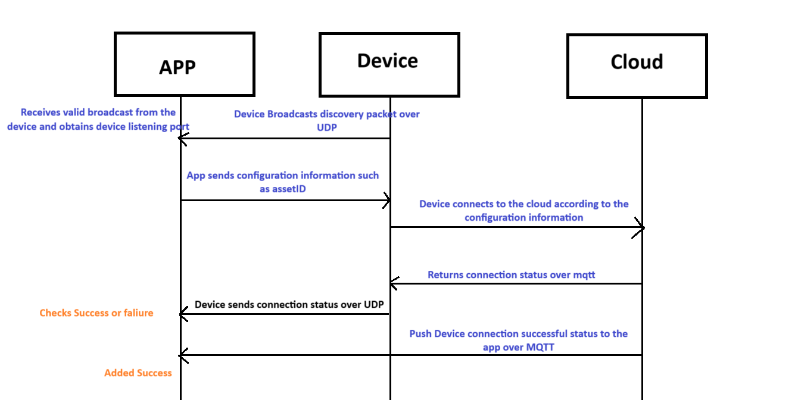

# Local LAN Discovery Protocol  

## Flow Diagram  



The protocol uses JSON format  

Broadcast address: 255.255.255.255  

## Network configuration process  

1. Device broadcast package

    ```JSON
    {
        "type":"thing.info.broadcast",
        "msgId":"45lkj3551234001",
        "ts":1626197189638,
        "data":{
            "name":"protco-device-name",
            "uuid": "rn135adawdasd",
            "pid":"S8rHEJgnoOkntd",
            "udpPort": 30000,
        }
    }
    ```

2. App sends network configuration information to the device (unicast)

    ```JSON
    {
        "type":"thing.network.set",
        "msgId":"45lkj3551234001",
        "ts":1626197189638,
        "data":{
            "force_bind":true,
            "sid":"XXsmart-2.4G", //Router ssid
            "pw":"31415926", //Router password
            "mq":"mqtt.protco.in", //mqtt host
            "bid":"ssssss321345e", //bind id
            "userId":"123123",// App User id
            "port":1883, //mqtt port
            "country":"IN", //Country code IN CN，US, JP, EP, AU
            "areaCode":"91", //Country Code 91
        }
    }
    ```

    Device Reply

    ```JSON
    {
        "type":"thing.network.set",
        "msgId":"45lkj3551234001",
        "ts":1626197189638,
        "data": {
            "code" : 0, //0 for success, others for failure
            "msg":"error message", //
            "uuid" : "12312412", //Which UUID
        }
    }
    ```
